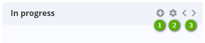

Title: Gerenciamento ágil Simple

# Gerenciamento ágil Simple

O CITSmart Simple é uma funcionalidade da plataforma CITSmart ESP que permite o
gerenciamento fácil e ágil de atividades. Foi criado para gerenciar os projetos
da maneira mais simples, com recursos para organizar, monitorar e delegar as
atividades entre os membros de sua equipe ou individualmente.

O Simple é baseado na metodologia Kanban, onde os mesmos são organizados
visualmente em um quadro disposto de cartões que sinalizam o andamento do fluxo.

Na área de trabalho do Simple as atividades são inseridas e agrupadas por
projetos (no Simple chamados de Workspaces), painel de tarefas (no Simple
chamados de Sprint) e por fim as tarefas, que podem estar em grupos de cartões.

Procedimento
------------

*I - Criar um Workspace*

1.  Acessar a funcionalidade através do menu principal Gestão Integrada \>
    Simple – Gestão Ágil;

2.  Clicar no botão “Workspace” e colocar nome para criar novo Workspace;

3.  Cada Workspace conterá em sua tela inicial um resumo de Sprints e seus
    prazos estabelecidos:

    -   Vencidas: mostra o total dos **Sprints** que tenha a “Data da entrega” menor
    que a data/hora atual;

    -   A vencer: mostra o total dos **Sprints** que tenha a “Data da entrega” que
    ficarão vencidas em 24h a partir da data/hora atual;

    -   No prazo: mostra o total dos **Sprints** que tenha a “Data da entrega” maior
    que 24h a partir da data/hora atual;

    -   Total: soma das **Sprints** que estão dentro do Workspace.

*II - Criar uma Sprint*

1.  Clicar no Workspace criado anteriormente;

2.  Clicar no botão “Sprint”, nomear e “Salvar”;

3.  Cada Sprint conterá em sua tela inicial um contador de tarefas, horas
    despendidas e planejadas, totalização de tarefas por prazos estabelecidos e
    percentual de realização das mesmas:

    -   Vencidas: mostra o total de **tarefas** que tenha a “Data da entrega” menor
    que a data/hora atual;

    -   A vencer: mostra o total de **tarefas** que tenha a “Data da entrega” que
    ficarão vencidas em 24h a partir da data/hora atual;

    -   No prazo: mostra o total de **tarefas** com a “Data da entrega” maior que
    24h a partir da data/hora atual;

    -   Total: mostra o total de **tarefas** daquela Sprint;

    -   A barra de progressão possui o seguinte cálculo:

        -   1º É feito a soma do total de estimativas de todas as tarefas
            concluídas;

        -   2º É feito a soma do total de estimativas de todas as tarefas;

        -   3º Progresso é a porcentagem calculadas com o total de estimativas das
            tarefas concluídas sobre o total de estimativas de todas as tarefas.

!!! Abstract "ATENÇÃO"

    O cálculo do progresso depende totalmente das estimativas informadas nas
    tarefas.

    
Figura 1 - Tela Sprint

   -   1: pesquisar Sprints com filtros de membros, tags e status da Sprint
    (concluída e não concluída)

   -   2: criar nova Sprint

   -   3: abreviação dos nomes dos membros adicionados. Ao clicar é possível
    excluir e definir se o membro será administrador ou não

   -   4: adicionar membros que participarão da Sprint

   -   5: ações de configuração e permissão da Sprint

*III - Criar listas*

1.  Dentro de cada Sprint são disponibilizadas listas default do sistema: “Para
    fazer, Em andamento e Concluída”;

2.  Para criar nova lista, clicar no botão “+Lista”, nomear e “Salvar”.

    
    
    Figura 2 - Tela lista

    -   1: pesquisar tarefas com filtros de membros, tags e status da lista
    (concluída e não concluída)

    -   2: criar nova lista

    -   3: atualizar a tela

    -   4: abreviação do nome do membro adicionado. Ao clicar é possível excluir e
    definir se o membro será administrador ou não

    -   6: definir data, hora e estimativa de horas para entrega

    -   7: visualizar o histórico de ações

    -   8: arquivar lista de tarefas

*IV - Criar tarefas*

   
    
   Figura 3 - Tela tarefa

   -   1: criar nova tarefa

   -   2: definir em qual estágio a tarefa se encontra.

   -   3: mover a lista fisicamente dentro do quadro

!!! Abstract "ATENÇÃO"

    Para movimentar uma tarefa de uma lista para outra, clicar e arrastar a
    mesma para a lista desejado.

*V - Preencher cartão Simple*

O cartão Simple contém campos e botões para descrever uma tarefa/ação com
planejamento e controle de datas, horários, checklist e diversos outros
dispositivos de controle e gestão.

1.  Cada cartão possui dispositivos de controle e informações:

     
    
      Figura 4 - Tela cartão

    -   1: adicionar ou retirar membros na tarefa

    -   2: adicionar listas de ações que serão visualizadas na aba Checklist

    -   3: adicionar comentários

    -   4: cada membro pode lançar horas referente ao seu tempo utilizado na tarefa,
    além de detalhar a ação tomada

    -   5: adicionar tags para identificar visualmente o cartão de tarefa

    -   6: clicar para ser comunicado sobre qualquer modificação nesta tarefa. Esta
    comunicação será através do botão de notificações do CITSmart ESP

    -   7: indicar a finalização da tarefa

    -   8: Mover a tarefa para outra Sprint:

        -   Sprint do mesmo Workspace: as tags são mantidas, porém os membros são
            removidos da tarefa

        -   Sprint de outro Workspace: as tags e membros serão removidos da tarefa

    -   9: arquivar o cartão – Uma vez arquivado, nesta versão, o cartão não poderá
    ser reutilizado.

1.  Descrever a tarefa no campo “Descrição”;

2.  Definir a data e hora de entrega no campo “Data de entrega”;

3.  Estimar a quantidade de horas que serão utilizadas na tarefa;

4.  No campo “Horas lançadas” o sistema contabilizará automaticamente o total;

5.  As abas disponibilizadas mostram:

    -   Checklist: ao adicionar um checklist será criado um item nesta aba. Para
    nomear, posicionar o mouse no campo “Adicionar item...”, clicar no botão de
    adicionar “+” para adicionar novo item. Para indicar finalização de um item
    dentro de um checklist, selecionar o checkbox;

    -   Comentários: lista os comentários realizados;

    -   Anexos: disponibiliza campo para adicionar anexos;

    -   Horas lançadas: relaciona horas lançadas de cada membro participante da
    tarefa;

    -   Histórico: mostra todas as ações realizadas dentro do cartão, com data e
    hora.

!!! tip "About"

    <b>Product/Version:</b> CITSmart ESP | 8.00 &nbsp;&nbsp;
    <b>Updated:</b>02/13/2019 – Anna Martins

