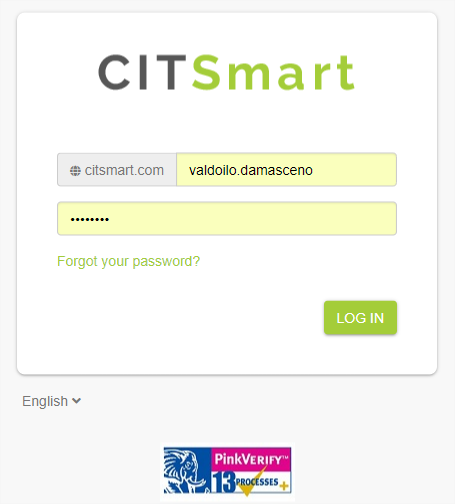

Title: What's new in CITSmart 8.0?
Description: It describes what is new in CITSmart 8.0

What's new in CITSmart 8.0?
=================================

Logo and Login Usage
------------------------

The use of the CITSmart image has been optimized to improve data usage, as well as the application within the solution, making it simpler, lightweight and suitable for new product directions.

Experience Center
---------------------

Through the Experience Center, it's possible to build relationship portals with their own visual identity for customers, providers and employees, promoting visibility and collaboration.

Each Experiment Center has dynamic pages with the following options of widgets:

*   Portfolios
*   Requests
*   Approvals
*   Knowledge Center
*   Neuro Applications
*   Workspaces
*   News
*   Notifications
*   Searches
*   Youtube
*   Images
*   Menu
*   List
*   Text
*   Chat
*   Voip
*   Others

Experience Centers can be created according to the access profiles and needs of the business areas.

### Portfolio Widget

It's used in the Experience Center to list the Portfolios, with their Services and Request, being able to replace the use of the services portal.

### My Requests Widget

Lists the tickets of the user logged **(a.)**, provides a history of attendance with a timeline **(b.)** and allows the requester to add notes and comments **(c.)**, notify the attendant by email or, it's also possible to use chat with the attendant **(d.)**.

For further information **XXXXXXX (colocar link do CE)**

### My Approvals Widget

Approving a ticket by CITSmart is simpler, just click on the approve icon **(a.)**, you can view the ticket details and approve it or not **(b.)**.
 

Menus
----

Internally, the menus have been reorganized and now they're arranged on the left side, with the possibility of consultation and concealment, improving the workspace in the platform.

Smart Decisions
---------------

It allows to maintain and view workareas by users with:

* Dashboards widgets
* Native Reports and
* Reports built in the platform. 

**Each user can configure their own area with one or more tabs.**

Quick Access
-------------

It's available new icons and quick access area to the processes and portals in the upper area of the platform, in order to make it easier and more practical to access the CITSmart functionalities. 

Ticket Management
-----------------

Its new layout presents information in a more structured way, in a side menu with the option to hide, a significant improvement of performance and user experience **(a.)**. In the creation of tickets, there is a new multilevel search that allows to search for portfolios, services and activity in a visual and fast way (it's no longer available to filter by category) **(b.)**, it's possible to follow graphically the execution of the flow **(c.)**. The attendant can send a message to the requesters and notify them by email **(d.)**.

The registration of events was replaced by the registration of notes and comments, with the possibility of notifying the requester by email, launching service hours and controlling the display of the registers **(a.)**, and the entire execution of the flow and attendance registries, for example, capturing, delegating, suspending, SLA and others are displayed in a history in the timeline format. Messages with the requester are also stored here **(b.)**.

Now, as soon as a new Workaround is created, a notification is automatically triggered for the Incident responsible **(a.)** and you can view the workaround and copy the contents to the incident closure, completing the cause and answer solution answer **(b.) (c.)**.

Simple - Agile Management
--------------------

Simple, which brought the power of agile management for CITSmart platform, developed to help teams to be more collaborative and participatory, increasing productivity and giving more autonomy and visibility to members of a simple and practical way **(a.)**. Each team can have one or more workspace **(b.)** and create sprints with kanbans and phases, according to each need **(c.)**.

Each task can have one or more members. You can add:

*   Checklists
*   Comments
*   Estimation
*   Worked hours
*   Tags
*   Files
*   Enable notifications, others.

For further information...  **XXXXXXX (colocar link do SIMPLE)**

Problem Management
--------------------------

Problem Management has been redesigned to give more agility, ease and practicality to the team work. With a new listing panel and tracking, it's possible to change the columns displayed, enable automatic updating, view flow progress, search problem registration, access list of dynamic reports and others.

To facilitate the treatment of the problem, a sequence of steps was structured in a lateral menu. 

*   Requester information
*   Incidents related to the problem
*   Problem
*   Diagnosis
*   Solution
*   Review and Closure

It's now possible to link and view, on one screen, the list of incidents that generated the problem **(a.)**. The problem registration started to use the concept of portfolio of templates **(b.)**. Templates are pre-registered with the attendance flow, responsible group, status and others, making the creation, classification and attendance of problems more practical **(c.)**.

When Linking a Service to the Problem, it's possible to view the Service Map and the List of its CI **(a.)**, just two clicks on the CI to view the details **(b.)**, and from the list of CI, it's possible to link those that are related to the problem **(c.)**.

A new diagnostic area was created and allows that, through Simple, more people or teams work collaboratively in the analysis of the problem, bringing agility and efficiency **(a.)**; the known error registration, root cause and workaround is easier. A new notification is sent to the person responsible for the incident as soon as each workaround is registered **(b.)**.

There is also a new Solution area with direct link to the Simple and change registers, allowing the design, development and deployment of the solution to be more agile and collaborative, achieving better results **(a.)**; the Review and Closure tab allows to report if the problem has been successfully solved or not. It's also possible to register lessons learned, notes and open sprints for problems whose review involves more people or teams **(b.)**.

For further information... **XXXXXXX (colocar link do problema)**.

Configuration and Assets Management
--------------------------------------

In order to make to search and view CIs faster and more practical, the Configuration and Assets Management panel has been redesigned, considering the best experience for the user. The new search allows you to filter by groups, types, alerts and identification. 

The panel has a new Group Widget that allows the access and navigation between the CMDB structures **(a.)**; The Alerts Widget displays the list of CI with the amount of Incidents, Problems, Changes, and Release opened **(b.)**; othe types of CIs are also arranged in a new Widget with the quantitative CIs **(c.)**; and when accessing the type, the list of CI is displayed grouped and with the quantitative CIs, according to the identification **(d.)**.

The CI visualization has also been optimized. The main information and features of the CI are now displayed in the General area **(a.)** and the warranty information is also displayed in a new Widget **(b.)**.

For further information...  **XXXXXXX (colocar link do Configuração e CMDB)**

Change Management
-------------------------

CITSmart has evolved the Change Management to give more agility, security and practicality to changes in environments that go beyond the IT. With a new list panel, it's possible to change display columns, enable automatic updating, view flow progress, search registers, access the list of dynamic reports and others.

To facilitate the attendance, the following sequence of steps was structured in the side menu:

*   Requester information
*   Request for change information
*   Change planning
*   Reversion plan
*   Review and closure
*   CI related

To facilitate the organization and classification of change registrations, CITSmart started to use the concept of Change Portfolio, allowing pre-set templates with attendance flow, calendar, responsible groups and others **(a.)**, and the classification of change has become much simpler and more agile **(b.)**.

It's also possible to link to the templates, the agile risk analysis forms. Each change template can use a form with questions and weights. According to the analysis, a risk graph is presented **(a.)**. The Planning, Reversal, Revision and Closure of a Change now have an agile management dashboard ("Simple" concept), so multiple teams can execute tasks in a fast, transparent and collaborative manner **(b.)**.

In the review and closure of a change, in addition to informing if the change was successful or not, it's also possible to link a form to analyze the quality of the change, in addition to the link with Incidents, Problems, Lessons learned and others.

For further information...  **XXXXXXX (colocar link da Mudança)**.

### Deployment and Release Management

he Deployment and Release Management process also passed through evolutions. The list pane follows the same pattern presented in the Problem and Change Management processes.

In the side menu, it was structured a sequence of steps to facilitate the follow-up of the release **(a.)**,  and the packaged changes for the release are presented on the same screen, making it easier to follow **(b.)**. The Planning and Deployment now have an Agile Management dashboard ("Simple" Concept), facilitating the involvement and collaboration of several teams **(c.)**.

### Business Intelligence

One of the optional modules in this new version is the Smart Analytics, that allows the use of the Saiku Community BI framework for data analysis of Tickets, Changes, Releases etc and others **(a.)**, various views of charts and tables are available, with the possibility of filters and export to csv and pdf **(b.)**.

### Audit Trail

Audit trails have been created to give more transparency to the data usage and security of our system, there are three Audit options: **data**, **access** and **key**. 

[For further information...](https://docs.citsmart.com/pt-br/citsmart-platform-8/platform-administration/logs-and-auditing/system-audit.html)

**Data audit.**

This auditing option displays the history of all change, inclusion, and deletion of data in the system.

**Access audit**

This option presents the history of system accesses (inputs and outputs).

**Key audit**

In this audit option, it informs the licenses used for the validation of the system.

### Mobile Field Service App

The App FS was created to give more flexibility and agility in field service. App features can run offline and then synchronized easily.

[For further information...](https://docs.citsmart.com/pt-br/citsmart-platform-8/additional-features/mobile-and-field-service/apps/citsmart-field-service-manual.html)

### App Service Management

The Mobile SM App was created so that the features and benefits of the CITSmart solution can also be accessed via mobile devices, this new version includes notifications for the Android operating system and the possibility of confirmation for attendance via subscription.

[For further information](https://docs.citsmart.com/pt-br/citsmart-platform-8/additional-features/mobile-and-field-service/apps/citsmart-app-android.html)

!!! tip "About"

    <b>Product/Version:</b> CITSmart Platform | 8.00 &nbsp;&nbsp;
    <b>Created:</b>03/14/2019 - André Fernandes

