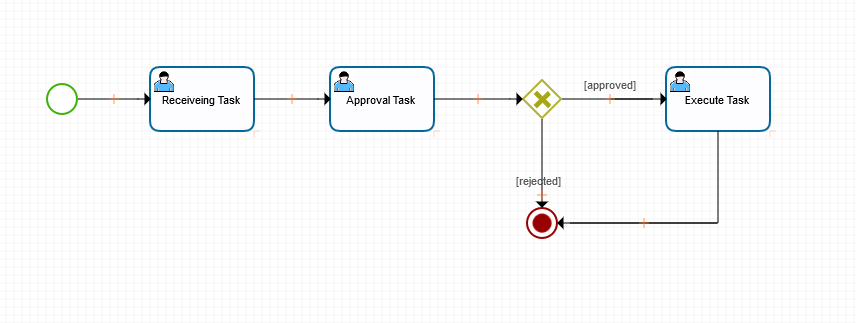

title: Manutenção de fluxo de trabalho
Description: Modelar seus objetivos de negócio, descrevendo os passos que precisam ser executados para atingir esses objetivos, através de um fluxograma.
#Manutenção de fluxo de trabalho

A funcionalidade de Manutenção de Fluxos tem a finalidade de modelar seus
objetivos de negócio, descrevendo os passos que precisam ser executados para
atingir esses objetivos através de um fluxograma.

Procedimento
------------

1.  Acessar o menu principal Sistema \> Manutenção de fluxo;

2.  É apresentada a tela inicial da funcionalidade. A seguintes atividades estão
    disponibilizadas aqui:

    -  Podemos buscar os fluxos previamente cadastradas ao clicar em “Filtros
        avançados” e preencher os dados;

    -  No botão “Editar” poderá existir várias versões do mesmo fluxo;

    !!! Abstract "NOTA"

        O versionamento tem por objetivo preservar o estado do fluxo de trabalho que
        está vinculado a algum serviço, evitando alterações em fluxo produtivo.  
        
     -  A opção “Exportar” permite a exportação do fluxo no formato JSON;

     -  Em “Excluir” é possível remover os fluxos.

    !!! Abstract "NOTA"

        A exclusão só será possível se não houver nenhum serviço vinculado ao fluxo
        a ser removido.  
        
3.  Ao clicar em “Editar” e selecionar qualquer versão do fluxo serão
    apresentadas as informações do fluxo em três abas: “Dados do fluxo”,
    “Diagrama” e “Documentação”. Cada qual tem a seguinte função:

-   Na aba “Dados do fluxo”, será exposto os dados com as informações do fluxo,
    tais como: o seu nome, o processo a que está vinculado (O fluxo estará
    visível apenas para o processo a que está vinculado), sua versão, a
    descrição do fluxo e a opção para permitir a reabertura de um serviço
    independentemente das configurações de grupo.

    !!! tip "DICA"

        A opção de reabertura no fluxo pode ser útil em
        cenários em que existem muitos serviços onde a reabertura é permitida, sendo assim, ao marcar a opção "permitir reaberutra" não é necessário utilizar a ação "reopen" na permissão do fluxo.

-   A aba “Diagrama” representa uma ferramenta de design de fluxo. No lado esquerdo
    desta tela encontra-se a organização dos elementos que compõe a
    funcionalidade de fluxo. Ao clicar em cada um destes elementos, estará
    acessível cada atividade realizada por este elementos, que são:

    -   **Eventos:** são os elementos de eventos que podem ser utilizados no
        desenho do fluxo. São eles:

        -   Evento Início;

        -   Evento Intermediário de Envio de Link

        -   Evento Intermediário de Captura de Link

        -   Evento Intermediário de Temporizador

        -   Boundary - Evento Intermediário de Captura de Erro

        -   Evento Intermediário de Captura de Sinal

        -   Evento de Finalização com Erro

        -   Evento de Fim

    -   **Atividades**: são os elementos de atividades que podem ser utilizados
        no desenho do fluxo. São eles:

        -   Tarefa de Usuário

        -   Tarefa Script

        -   Envio de Mensagem – E-mail

        -   Business Rule Task

        -   Tarefa de Serviço – ESI

        -   Armazenamento de Dados

        -   Subprocesso

    -   **Extensões**: são as extensões que podem ser utilizadas no desenho do
        fluxo. São elas:

        -   Comunicação REST

        -   Notificação

        -   Atribuição de Variável

        -   Conversação Watson

    -   **Gateways**: são os elementos de gateway que podem ser utilizados no
        desenho do fluxo. São eles:

        -   Gateway Inclusivo

        -   Gateway Paralelo

        -   Gateway Exclusivo

        -   Gateway Complexo

        -   Gateway Baseado em Evento

    -   **Swimianes:** são os elementos de swimianes que podem ser utilizados no
        desenho do fluxo. São eles:

        -   Pool/Participante

        -   Lane

    -   **Artefato**: é o elemento de artefato que podem ser utilizados no
        desenho do fluxo. São eles:

        -   Anotação de Texto

    -   Nesta aba, também é permitido ao clicar no botão “Gerar Documentação” a
        exportação em PDF das informações geradas na aba “Documentação”. Além
        disso, ao clicar em “Gravar”, podemos escolher a forma deste
        armazenamento (“Como nova versão” que significa versionar e gerar uma
        nova visão do fluxo ou “Na versão original” que significa salvar o fluxo
        na versão atual, a que está sendo editada).

-   Na aba “Documentação” é gerada uma visão de todo as informações do fluxo
    (diagrama, descrição de elementos utilizados no diagrama).

!!! Abstract "NOTA"

    Vale lembrar que:

    - as normativas configuradas no fluxo terão prioridade em relação às
    marcações do template de solicitação de serviço, pois esta é um complemento do fluxo;

    - para usar o componente "Conversação Watson" a organização deve possuir a
    arquitetura IBM BlueMIX, possibilitando assim acesso à API Conversation do Watson;

    - para excluir um elemento que foi inserido no desenho do fluxo, clicar no
    mesmo e pressionar as teclas Ctrl+Delete.

Diagrama de um fluxo de trabalho
-------------------------------------

-   1 – Representa o inicio do fluxo de trabalho;

-   2 – Representa uma tarefa do usuário a ser realizada no fluxo (que neste
    caso significa ‘receber a tarefa’);

-   3 – Representa a segunda tarefa do usuário a ser executada no fluxo (que
    neste caso significa ‘aprovação ou rejeição da tarefa’);

-   4 – Representa o “Gateway exclusivo” (que representa uma condição de fluxo
    exclusiva, em que um dos caminhos criados a partir do Gateway será seguido,
    de acordo com uma informação a ser testada. Este gateway pode ser
    representado visualmente como o losango vazio ou com um marcador de “x”) do
    fluxo;
	
-   5 – Representa o evento final do fluxo de trabalho (que neste caso significa
    a conclusão de exucução da tarefa ou a rejeição da tarefa);	

-   6 – Representa a terceira tarefa do usuário a ser desempenhada no fluxo (que
    neste caso significa ‘executar a tarefa’, se a mesma tiver sido aprovada).

!!! tip "About"

    <b>Product/Version:</b> CITSmart ESP | 8.00 &nbsp;&nbsp;
    <b>Updated:</b>01/18/2019 - Anna Martins
