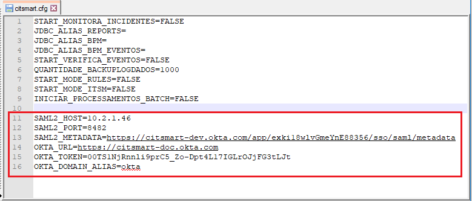

title: Configurar o Okta no CITSmart
Description: O Okta conecta qualquer usuário com qualquer aplicativo em qualquer dispoitivo. Este documento explica a forma ideial de conectar esta solução ao CITSmart.
# Configurar o Okta no CITSmart

O Okta é uma solução que conecta qualquer usuário com qualquer aplicativo em qualquer dispoitivo. Este documento explica a forma ideial de conectar esta solução ao CITSmart.

Antes de começar
--------------------

A configuração desta solução é um processo de diversas fases. A primeira fase é a criação de uma conta Okta.

Procedimento
----------------

*1º Passo: Criar uma conta Okta:*

1. Acessar o site:  https://www.okta.com;

2. Clicar em "Try Okta" e em seguida "Sign up today";

3. Informar os dados essenciais (e-mail, nome e sobrenome);

4. Apertar o botão "Get Started" para concluir a operação. Em seguida, verifique o e-mail cadastrado (que enviará um link de acesso), acesse a conta com a senha temporária enviada e altere a mesma para maior segurança dos dados;

*2º Passo: Criar a aplicação CITSmart dentro do Okta:*

1. Após concluído a etapa anterior, conectar-se ao Okta com sua conta recém criada;

2. Clicar na aba "Applications e em seguida no botão "Add Application";

      

3. Apertar em "Create New App";

      

4. Marcar a opção "SAML 2.0" e depois clicar no botão "Create";

      

5. No campo "App name", adcionar o nome da aplicação e logo após, é necessário clicar no botão "Next";

      

6. Configurar o caminho da aplicação e depois clicar no botão Next

    

    !!!Abstract "ATENÇÃO"
       No campo "Single sign on URL" e "Audience URI (SP Entity ID)" deverá ser incluído os endereços de URL no qual a Apilicação CITSmart será executada.  
     
7. Marcar as opções "I'm an Okta customer adding an internal app" e "This is an internal app that we have created". Logo em seguida, clicar no botão "Finish".

      

*3º Passo: Atribuir usuários a aplicação CITSmart do Okta:*

1. Concluído o passo anterior, é necessário clicar na aba "Applications > Applications" e em seguida em "Assign Applications" e opte pelo filtro chamado "People";

      

2. Em seguida, é possível escolher o usuário que terá a permissão de acessar a aplicação que está sendo criada. Clicar então no botão "Assign" e posteriormente para finalizar, clicar em  "Done";

      

*4º Passo: Incluir informações necessárias no CITSmart configurado no Okta:*

1. Será necessário configurar alguns dados no diretório do WildFly. Acessar o diretório, abrir a pasta "/standalone/configuration" e alterar o arquivo "citsmart.cfg".

      

  2. Acessado o arquivo, é preciso incluir estas informações no arquivo "citsmart.cfg":
       
       a) Na linha *SAML2_HOST* e *SAML2_PORT* incluir o endereço e porta da aplicação CITSmart;
       
       b)  Na linha *SAML2_METADATA* incluir os metadados SAML do Okta. Este dado pode ser obtido seguindo as seguintes instruções:
 
   - Acessar a aplicação CITSmart no Okta, clicar na aba "Applications > Applications" e em seguida na opção "Sign On". Ao apertar a opção "Identity Provider metadata", será exibido os metadados;
        
 

   c) Na linha *OKTA_URL*, incluir a URL principal da conta Okta.
   
   d) Na linha *OKTA_TOKEN*, incluir o token para acesso via API. Para obter este token, atenda estes passos:
   
   - Acessar a aplicação CITSmart no Okta, selecionar no menu a opção "Security > API" e em seguida clicar no botão "Create Token". Nomeie o token e aperte o botão "Create Token". Será então apresentado o valor do token que deverá ser copiado na linha citado acima.
   

  e) Na linha *OKTA_DOMAIN_ALIAS*, incluir o domínio dos usuários provinientes do Okta.
  
*5º Passo: Sincronizar usuário do Okta no CITSmart:*

1. Dentro do CITSmart, acessar o menu "Okta Config" e cadastrar uma nova configuração ao clicar no botão "Novo";

      

2. Preencher os campos com as informações necessárias:

      

   - **Descrição:** introduzir uma definição desta nova configuração Okta;
     
   - **Alias:** incluir o domínio do usuário que será gravado na base. Exemplo: okta\administrador@citsmart.com;
     
   - **URL de domínio:** deverá incluir o mesmo valor (URL) que foi inserida na linha *OKTA_URL* no arquivo "citsmart.cfg"; 
     
   - **Token API:** incluir o mesmo valor do token inserido na linha *OKTA_TOKEN* no arquivo "citsmart.cfg";
     
   - **Grupo:** inserir o ID do grupo no qual o usuário sincronizado e gravado pertencerá no CITSmart;
     
   - **Perfil de Acesso:** inserir o ID do perfil no qual o usuário sincronizado e gravado pertencerá no CITSmart;
     
   - **ID da aplicação:** incluir o ID da aplicação. Esta informação pode ser recuperada na URL do Okta, conforme a figura abaixo:
     
      

3. Clicar no botão "Salvar" e em seguida "Sicronizar usuários" para efetuar a operação.

O que fazer a seguir
----------------------

Concluído a integração do Okta com o CITSmart, alguns parâmetros do CITSmart podem ser configurados para melhor personalizar esta integração. São eles:

 - Como o okta não possui tela de logout, no parâmetro *377* do CITSmart podemos inserir algum endereço de página para redirecionar o usuário ao final da sessão;
 
 - O parâmetro *445* (Nome do grupo Administrador no Okta) permite escolher o grupo administrador na solução Okta. Se o usuário pertencer a este grupo escolhido, terá o perfil de acesso definido como administrador. Se não for este caso, o seu perfil de acesso será o perfil padrão definido pelo parâmetro *39*.
 
!!! tip "About"

    <b>Product/Version:</b> CITSmart | 8.00 &nbsp;&nbsp;
    <b>Updated:</b>05/30/2019 – Larissa Lourenço
