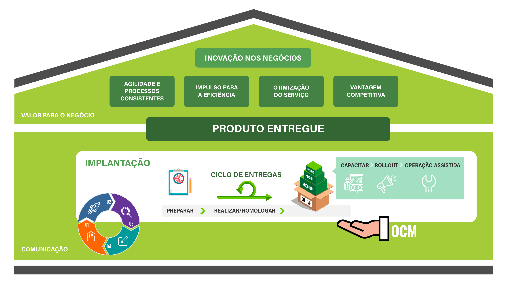

Title: Fast Deployment Methodology (FDM)
Description: AFast Deployment Methodology (FDM) é uma metodologia criada pela CITSmart Corporation, desenvolvida para prover a implantação dos produtos CITSmart.

Fast Deployment Methodology (FDM) 
==================================

O que é FDM?
------------

Fast Deployment Methodology (FDM) é uma metodologia criada pela CITSmart
Corporation, desenvolvida para prover a implantação dos produtos CITSmart de
maneira rápida, adequada às necessidades dos clientes e de acordo com os padrões
exigidos no mercado, ou seja, é alta entrega de valor primando pela
simplicidade.

<iframe width="560" height="315" src="https://www.youtube.com/embed/srL1bL_s-F4" controls="0" frameborder="0" allow="accelerometer; autoplay; encrypted-media; gyroscope; picture-in-picture" allowfullscreen showinfo=3></iframe> 

<iframe allowFullScreen="allowFullScreen" src="https://www.youtube.com/embed/jNQXAC9IVRw?ecver=1&amp;iv_load_policy=3&amp;rel=0&amp;showinfo=0&amp;yt:stretch=16:9&amp;autohide=1&amp;color=red&amp;width=560&amp;width=560" width="560" height="315" allowtransparency="true" frameborder="0">
</iframe>

!!! info "DOWNLOAD"
    [Fast Deployment Methodology (FDM)](artefatos/fdm_citsmart.pdf)

Etapas para implantação 
------------------------

Para uma maior eficácia, os passos da FDM foram construídos de forma ordenada e
baseados em gestões fundamentais:

-   **Mudança Organizacional**

Pessoas são o pilar fundamental de qualquer instituição e mudanças geralmente
podem ser desconfortáveis para a maioria delas, portanto é importante mapear os
usuários-chave do novo sistema e engajá-los para que se tornem disseminadores
internos da nova solução.

-   **Comunicação**

É importante que a comunicação aconteça no tempo certo e seja direcionada às
pessoas certas, assim, gargalos, riscos e qualquer outro fator de impacto
negativo pode ser tratado e mitigado proativamente.

-   **Projeto de Implantação**

Para a gestão de projetos utilizamos e nos inspiramos nas metodologias ágeis e
de gestão de projetos já consolidadas no mercado.

Estrutura da FDM
----------------

A FDM está organizada para trabalhar em um modelo flexível, onde diferentes
equipes conseguem executar seus trabalhos utilizando várias estruturas de
gerenciamento e padrões, mantendo a sincronização com os objetivos do cliente.

Artefatos da FDM
----------------

Os modelos de documentos utilizados e artefatos gerados na aplicação da FDM,
listados abaixo, são essenciais para a rastreabilidade e medição dos resultados
alcançados com o uso da metodologia.

| Artefato                                                                                               | Data       | Versão |
|--------------------------------------------------------------------------------------------------------|------------|--------|
| [Checklist da metodologia](artefatos/check_list_metodologia_citsmart_fdm.xlsx)                         | 21/05/2019 | V.1    |
| [Gerenciamento de riscos](artefatos/template_gerenciamento_de_riscos.docx) (template)                  | 21/05/2019 | V.1    |
| [Levantamento Requisitos](artefatos/template_levantamento_requisitos.xlsm) (template)                  | 21/05/2019 | V.1    |
| [Lições Aprendidas](artefatos/template_licoes_aprendidas.docx) (template)                              | 21/05/2019 | V.1    |
| [Matriz de Comunicação](artefatos/template_matriz_de_comunicacao.xlsx) (template)                      | 21/05/2019 | V.1    |
| [Matriz Gestao de Riscos](artefatos/template_matriz_gestao_de_riscos.xlsx) (template)                  | 21/05/2019 | V.1    |
| [Pesquisa de satisfacao projeto](artefatos/template_pesquisa_de_satisfacao_projeto.xlsx) (template)    | 21/05/2019 | V.1    |
| [Pesquisa de satisfacao suporte](artefatos/template_pesquisa_de_%20satisfacao_suporte.xlsx) (template) | 21/05/2019 | V.1    |
| [Plano de Comunicação](artefatos/template_plano_de_comunicacao.docx) (template)                        | 21/05/2019 | V.1    |
| [Plano de Projeto](artefatos/Template_Plano%20%20de%20projeto.docx) (template)                         | 21/05/2019 | V.1    |
| [Registro de reunião](artefatos/template_registro_de_reuniao.docx) (template)                          | 21/05/2019 | V.1    |
| [Requerimento de Mudança](artefatos/template_requerimento_de_mudanca.docx) (template)                  | 21/05/2019 | V.1    |
| [Reunião de KickOff](artefatos/template_reuniao_kickoff.pptx) (template)                               | 21/05/2019 | V.1    |
| [Roteiro de Teste](artefatos/template_roteiro_de_testes.xlsx) (template)                               | 21/05/2019 | V.1    |
| [Status Report](artefatos/template_status_report.docx) (template)                                      | 21/05/2019 | V.1    |
| [Termo de Aceite](artefatos/template_termo_de_aceite_da_entrega.docx) (template)                       | 21/05/2019 | V.1    |
